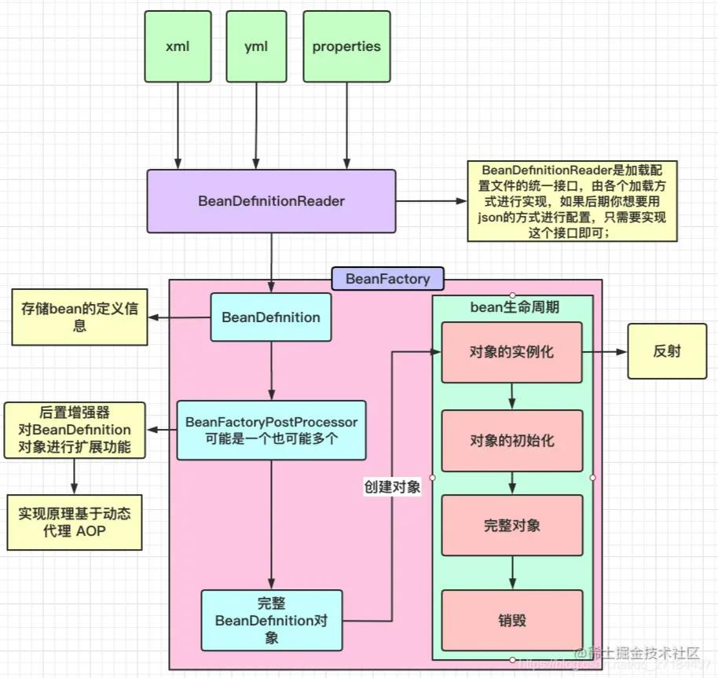
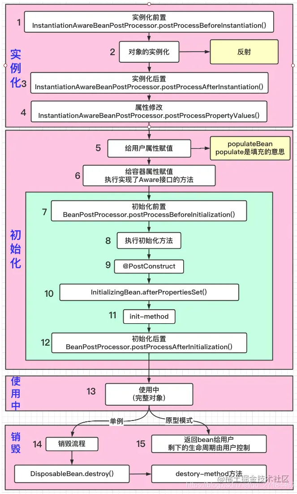

# SpringIOC和Bean的生命周期

## SpringIOC的加载过程

- 通过`BeanDefinitionReader`读取配置文件,生成bean的定义信息`BeanDefinition`
- 通过后置增强器`BeanFactoryPostProcessor`对`BeanDefinition`进行统一修改
- 生成完整`BeanDefinition`对象
- 开始创建对象，进入Bean的生命周期
---

## Bean生命周期
Bean生命周期流程:对象实例化->对象初始化->使用中->销毁


详细执行顺序:
注: 1,3,4,7,8都是针对所有Bean,有多少bean就执行多少次
1. 实例化前置 `InstantiationAwareBeanPostProcessor`的`postProcessBeforeInstantiation`方法
2. 通过反射实例化
3. 实例化后置 `InstantiationAwareBeanPostProcessor`的`postProcessAfterInstantiation`方法
4. 属性修改 `InstantiationAwareBeanPostProcessor`的`postProcessProperties`方法,如果实例化后置返回false,且mbd.getDependencyCheck())false,则不执行
5. 用户属性赋值,指给自己定义的bean填充属性, `AbstractAutowireCapableBeanFactory`的`populateBean`方法
6. 容器属性赋值,指容器自带的属性,目前12个接口,都继承了Aware接口
```java
@Component
public class AllAwareInterface implements BeanNameAware, BeanClassLoaderAware,
        BeanFactoryAware, EnvironmentAware, EmbeddedValueResolverAware,
        ResourceLoaderAware, ApplicationEventPublisherAware, MessageSourceAware,
        ApplicationContextAware, ServletContextAware, LoadTimeWeaverAware, ImportAware {

    @Override
    public void setBeanName(String s) {
        // BeanNameAware作用：让Bean对Name有知觉
        // 这个方法只是简单的返回我们当前的beanName,听官方的意思是这个接口更多的使用在spring的框架代码中，实际开发环境应该不建议使用
        System.out.println("1 我是 BeanNameAware 的 setBeanName 方法  ---参数：name，内容："+ s);
    }

    @Override
    public void setBeanClassLoader(ClassLoader classLoader) {
        // 设置类加载器
        System.out.println("2 我是 BeanClassLoaderAware 的 setBeanClassLoader 方法");
    }

    @Override
    public void setBeanFactory(BeanFactory beanFactory) throws BeansException {
        // 注意:如果使用 @Configuration 注解的话，setBeanFactory方法会执行2次，
        System.out.println("3 我是 BeanFactoryAware 的 setBeanFactory 方法");
    }

    @Override
    public void setEnvironment(Environment environment) {
        System.out.println("4 我是 EnvironmentAware 的 setEnvironment 方法");
        // 获取配置文件的属性
        String property = environment.getProperty("spring.redis.host");
        System.out.println("spring.redis.host:"+property);
    }

    @Override
    public void setEmbeddedValueResolver(StringValueResolver resolver) {
        System.out.println("5 我是 EmbeddedValueResolverAware 的 setEmbeddedValueResolver 方法");
        // 获取配置文件的属性
        String value = resolver.resolveStringValue("${spring.data.mongodb.port}");
        System.out.println("mongo port:"+value);
    }

    @Override
    public void setResourceLoader(ResourceLoader resourceLoader) {
        // 加载外部资源
        // resourceLoader即ApplicationContext
        ApplicationContext context = (ApplicationContext)resourceLoader;
        System.out.println("6 我是 ResourceLoaderAware 的 setResourceLoader 方法");
    }

    @Override
    public void setApplicationEventPublisher(ApplicationEventPublisher applicationEventPublisher) {
        // 发布事件
        // 实现ApplicationListener进行监听事件
        System.out.println("7 我是 ApplicationEventPublisherAware 的 setApplicationEventPublisher 方法");
    }
    
    @Override
    public void setMessageSource(MessageSource messageSource) {
        // 国际化消息通知操作
        System.out.println("8 我是 MessageSourceAware 的 setMessageSource 方法");
    }
    
    @Override
    public void setApplicationContext(ApplicationContext applicationContext) throws BeansException {
        // Spring容器会在加载完Spring容器后调用ApplicationContextAware.setApplicationContext方法
        // ApplicationContextAware 主要用来全局获取 ApplicationContext 上下文
        System.out.println("9 我是 ApplicationContextAware 的 setApplicationContext 方法");
    }
    
    @Override
    public void setServletContext(ServletContext servletContext) {
        // 当前web应用,context域对象
        System.out.println("10 我是 ServletContextAware 的 setServletContext 方法");
    }

    @Override
    public void setLoadTimeWeaver(LoadTimeWeaver loadTimeWeaver) {
        // LoadTimeWeaver 简称LTW，LTW是AOP的一种实现方式，此方法是为了获取Aop织入的对象，使用的织入方式是：类加载期织入，
        // 一般的aop都是运行期织入，就是在运行的时候才进行织入切面方法，但是LTW是在类加载前就被织入了，也就是class文件在jvm加载之前进行织入切面方法
        // 只有在使用 @EnableLoadTimeWeaving 或者存在 LoadTimeWeaver 实现的 Bean 时才会调用，顺序也很靠后
        System.out.println("11 我是 LoadTimeWeaverAware 的 setLoadTimeWeaver 方法");
    }

    @Override
    public void setImportMetadata(AnnotationMetadata importMetadata) {
        // 只有被其他配置类 @Import(XX.class) 时才会调用，这个调用对 XX.class 中的所有 @Bean 来说顺序是第 1 的。
        System.out.println("12 我是 ImportAware 的 setImportMetadata 方法");
    }
}
```
7. 初始化前置 `BeanPostProcessor`的`postProcessBeforeInitialization`
8. 初始化方法 @PostConstruct、InitializingBean、initMethod
9. 初始化后置 `BeanPostProcessor`的`postProcessAfterInitialization` (SmartInitializingSingleton(初始化结束后调用))
```java
@Component
public class MyBeanPostProcessor implements BeanPostProcessor {

    /**
     * 初始化前置
     * @param bean
     * @param beanName
     * @return
     * @throws BeansException
     */
    @Override
    public Object postProcessBeforeInitialization(Object bean, String beanName) throws BeansException {
        System.out.println("~~~~~~初始化前置：postProcessBeforeInitialization,beanName:"+beanName);
        return BeanPostProcessor.super.postProcessBeforeInitialization(bean, beanName);
    }

    /**
     * 初始化后置
     * @param bean
     * @param beanName
     * @return
     * @throws BeansException
     */
    @Override
    public Object postProcessAfterInitialization(Object bean, String beanName) throws BeansException {
        System.out.println("~~~~~~初始化后置：postProcessAfterInitialization,beanName:"+beanName);
        return BeanPostProcessor.super.postProcessAfterInitialization(bean, beanName);
    }
}
```
初始化方法@PostConstruct和InitializingBean都是初始化时调用，SmartInitializingSingleton是在所有非惰性单例Bean初始化完成后调用
注:A注入B,实例化顺序A->B,初始化顺序B->A
```java
@Component
public class TestInitMethod implements InitializingBean, SmartInitializingSingleton {

    @Autowired
    private TestUser user;

    public TestInitMethod() {
        System.out.println("######实例化中：构造方法");
        // user为null,此时user还没实例化
        System.out.println("######构造方法的user:"+user);
    }

    @PostConstruct
    public void test() {
        // user已经实例化，且user比TestInitMethod先初始化
        System.out.println("######初始化中: PostConstruct");
        System.out.println("######PostConstruct的user:"+user);
    }

    @Override
    public void afterPropertiesSet() throws Exception {
        System.out.println("######初始化中: afterPropertiesSet");
    }

    @Override
    public void afterSingletonsInstantiated() {
        System.out.println("######所有Bean初始化后: afterSingletonsInstantiated");
    }
}
```
10. Bean的使用
11. Bean的销毁